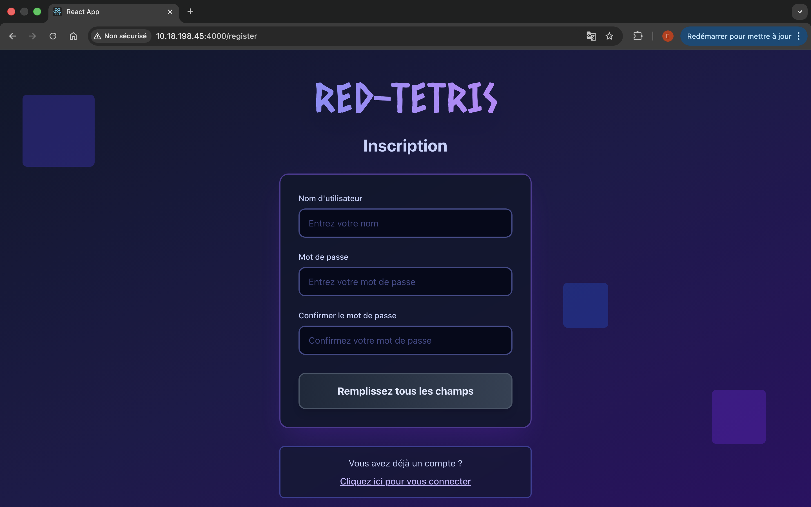
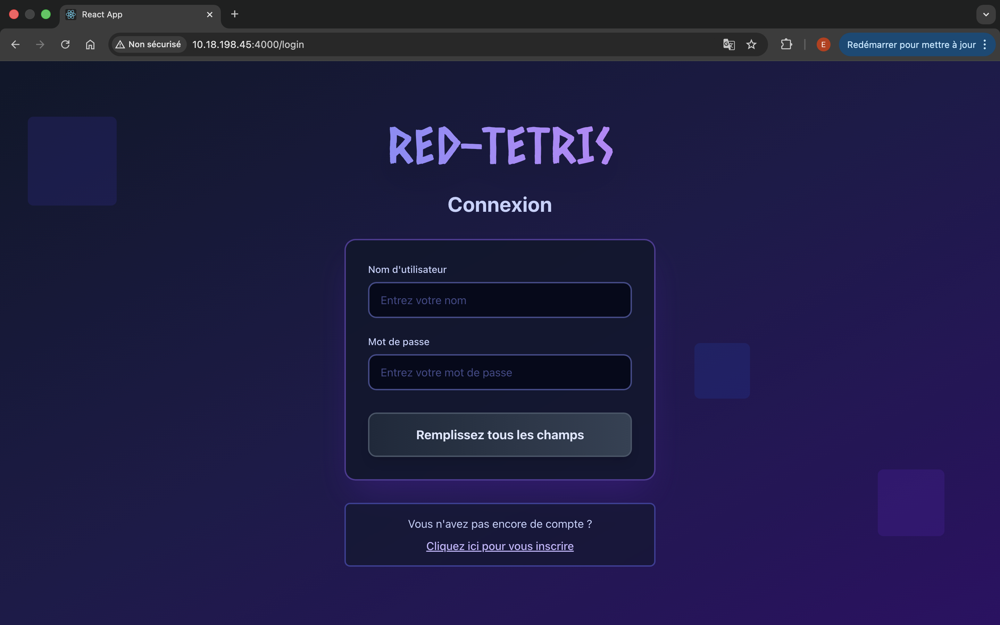
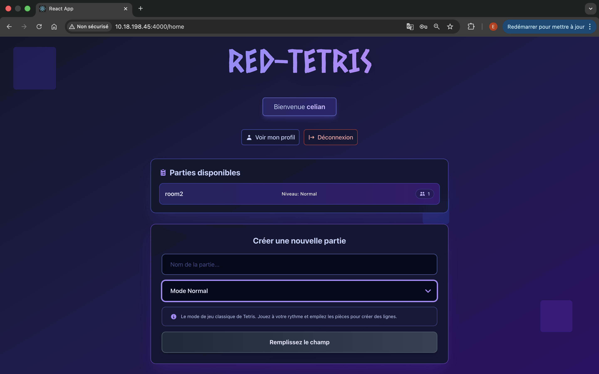
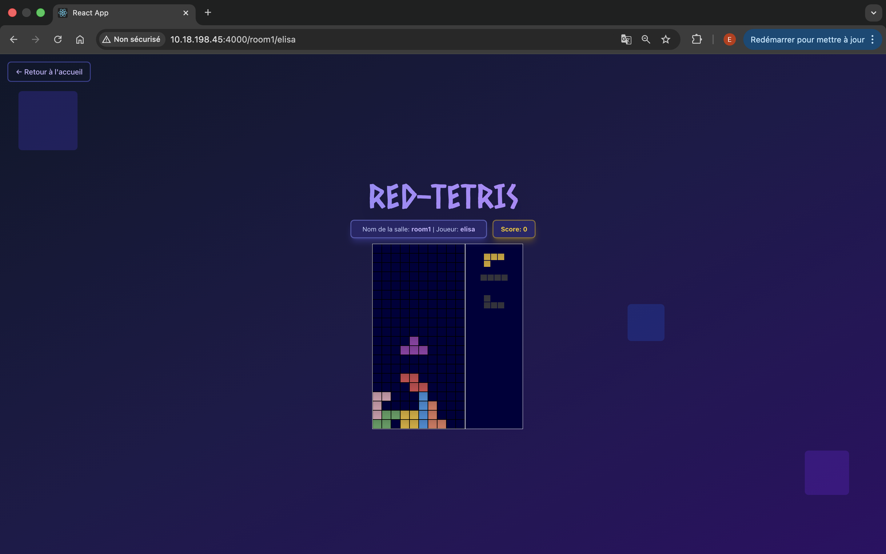
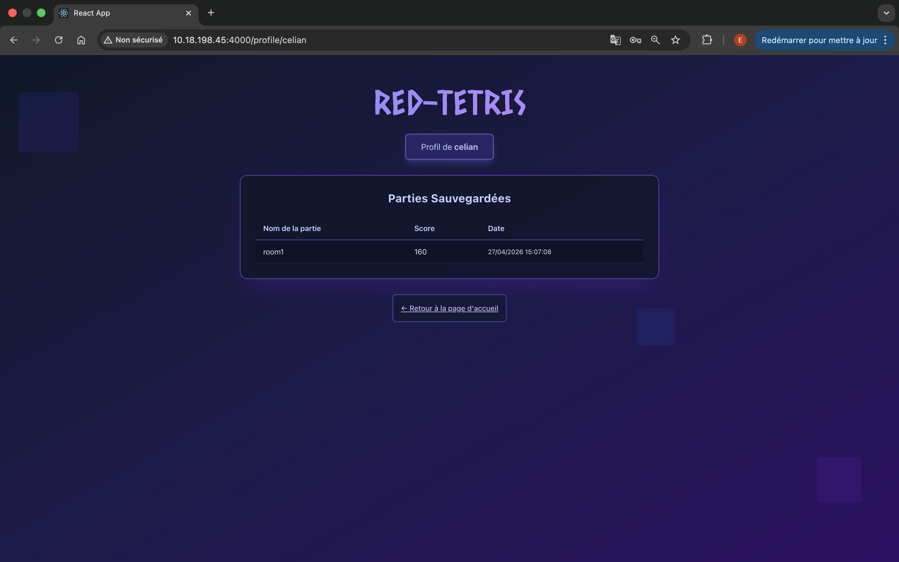

<h1> RED_TETRIS </h1>

     

<h2> Description </h2>

RED-TETRIS est une implémentation du célèbre jeu Tetris en version multijoueur temps réel, développée dans le cadre du cursus 42.

<h2> Objectifs du projet : </h2>

•  Création d’un jeu en temps réel  
•  Gestion de WebSockets  
•  Architecture frontend/backend  
•  Synchronisation entre joueurs  
•  Gestion des états de jeu  

<h2> Aperçu </h2>

  
 Inscription: 

  
  
 Connexion: 

  
  
 Page d'accueil avec salle de jeu disponible: 

  
  
 Salle de jeu: 

  
  
 Page de profil: 

  

<h2> Allez tester par vous même !</h2>

  [http://srv558899.hstgr.cloud:4000](http://srv558899.hstgr.cloud:4000)

  Vous pouvez utiliser le compte déjà créer

 • Nom d'utlisateur:  
  
    admin
 • Mot de passe:  
    
    password

<h2> Gameplay </h2>

•  Les joueurs rejoignent une room  
•  Les parties se déroulent en simultané  
•  Le but est de :  
&nbsp;&nbsp;&nbsp;    •  compléter des lignes  
&nbsp;&nbsp;&nbsp;    •  survivre plus longtemps que les autres  
•  Des pénalités peuvent être envoyées aux adversaires  

<h2> Contrôles </h2>

| Touche  | Action    |
| ------- | --------- |
| 
 ⬅️ / ➡️ 
 | 
 Déplacer 
|
| 
 ⬇️ 
     | 
 Accélérer 
|
| 
 ⬆️ 
     | 
 Rotation 
|
| 
 Espace 
 | 
 Hard drop 
|

<h2> En solo ou à plusieurs </h2>

<h4> Fonctionnalités: </h4>

•  Créer / Rejoindre une room  
•  Synchronisation en temps réel  
•  Pénalisations entre joueurs  
•  Gestion des connexions/déconnexions  

<h4> Features </h4>

•  Jeu Tetris d'origine  
•  Système multijoueur temps réel  
•  Communication via Websockets  
•  Architecture client / serveur  
•  Gestion des collisions et rotations  
•  Score / lignes  

<h2> Architecture </h2>

📦 red-tetris  
┣ 📂 back       
 ┃ ┣ 📂 game    
 ┃ ┗ 📜 server.js    
 ┣ 📂 front          
 ┃ ┣ 📂 src  
 ┃ ┃ ┣ 📂 game   
 ┃ ┃ ┣ 📂 users  
 ┃ ┃ ┗ 📜 App.js    
 ┣ 📜 package.json  
 ┗ 📜 README.md  

<h2> Bonus </h2>

Utilisateur:  
&nbsp;&nbsp;&nbsp;•  Creation de compte  
&nbsp;&nbsp;&nbsp;•  Page de profil avec historique des parties  

Jeu:  
&nbsp;&nbsp;&nbsp;•  Système de score  
&nbsp;&nbsp;&nbsp;•  Implémentation de différents modes de jeu  

<h2> Technologies utilisées </h2>

•  JavaScript  
•  Node.js  
•  Socket.io  
•  React  
•  Tailwind  

